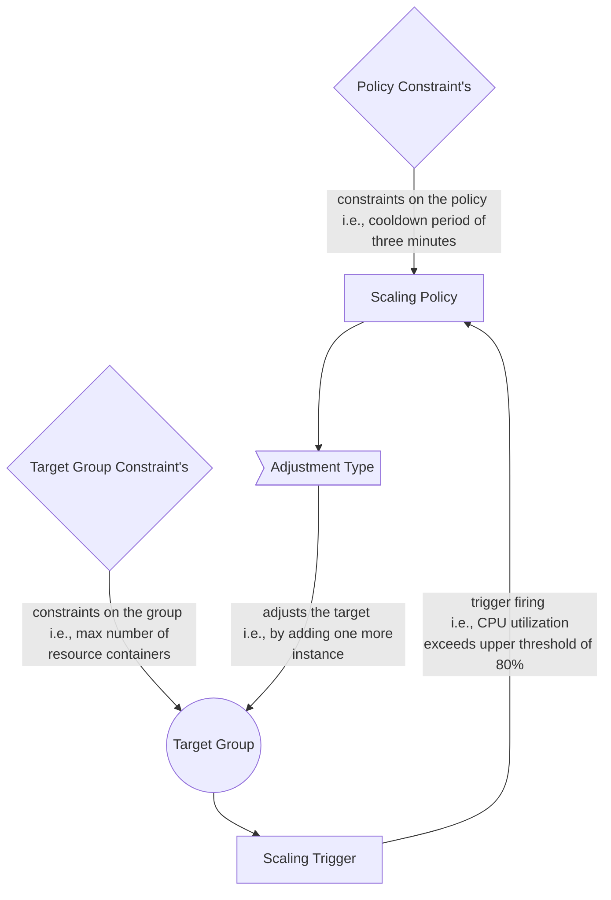

# The Scaling Policy Definition (SPD) Meta-model

This repository contains the metamodel for defining scaling policies that can be simulated in Palladio and thus 
help self-adaptive system architects to evaluate elasticity policies more efficiently. 

Below is a conceptual overview of the meta-model and the key elements behind the SPD language. 

# Compatibility with other tools
Other tools build upon the meta-model and the meta-model is in the inception phase, hence it is evolving and being refactored. To help you understand which tool works with which version we rely on tags for now. 

* Graphical Syntax for SPD -> supports the meta-model definition tagged [v0.1](https://git.rss.iste.uni-stuttgart.de/slingshot/spd-meta-model/-/commits/v0.1 ) 

